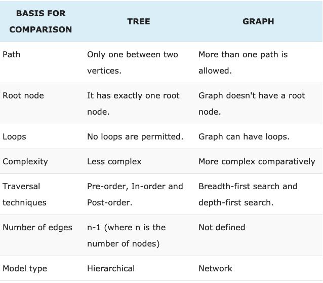

## Basics for a Tree
- looks like a tree!
- great for searching!
- great for sorted lists!
- one node at top! this is the root node
- below the root are the root's children; children can have their own children
- the root is the parent of it's children. children have only one parent
- if two or more nodes share a parent, they are siblings
- terminology summarized
    - nodes
    - root
    - child
    - parent
    - siblings
    - neighbor
    - descendant
    - ancestor
    - leaf
    - branch
    - edge: line that connects two nodes
    - path
    - distance
    - depth
    - level
    - width
    - height
    - breadth
- if a cycle is involved, it's not a tree!

_work these into the above_
Level – A tree is partitioned into levels such a way that the root node is at level 0. Then, its immediate children are at level 1, and its immediate children are at level 2 and so on up to the terminal or leaf node.
Degree – It is the number of subtrees of a node in a given tree.
Depth – It is the maximum level of any node in a given tree and also known as height.
Terminal node – The highest level node is terminal node while other nodes except terminal and root node are known as non-terminal nodes.

* from https://techdifferences.com/difference-between-tree-and-graph.html