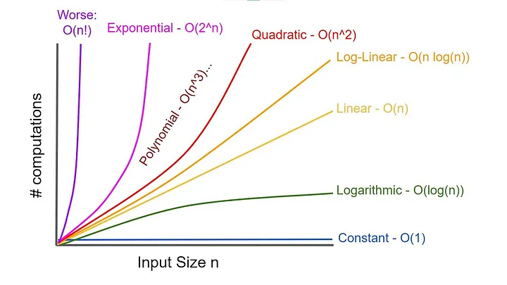

# Weekly Learnings: August5toAugust12


## New and Reviewed Weekly Problems

### Interview Cake
- [find_duplicates](./find_duplicate.py)
- [in_place_shuffle](./in_place_shuffle.py)
- [inflight_entertainment](./inflight_entertainment.py)
- [product_of_all_other_numbers](./product_of_all_other_numbers.py)
- [sort_scores](./sort_scores.py)
- [word_cloud](./word_cloud.py)

### Leetcode Greedy Algo practice
- [609_can_place_flowers](../../../leetcode_python/2024/easy/609_can_place_flowers.py)
- [680_valid_palindrome_ii.py](../../../leetcode_python/2024/easy/680_valid_palindrome_ii.py)
- [857_mininum_cost_to_hire_k_workers](../../../leetcode_python/2024/hard/857_minimum_cost_to_hire_k_workers.py)
- [122_best_time_to_buy_and_seel_stock_ii](../../../leetcode_python/2024/medium/122_best_time_to_buy_and_sell_stock.py)
- [137_gas_station](../../../leetcode_python/2024/medium/137_gas_station.py)
- [11_container_with_most_water](../../../leetcode_python/2024/medium/11_container_with_most_water.py)

## Tracking Weak Spots
- I am really, really, struggling to understand what exactly the problem is asking me to do. I have the gist of greedy algos down pat enough to explain to others. I can even use google draw to show patterns. I am having extreme difficulty translating patterns to code. I am also having trouble understanding WHICH variables should be greedy. Using Leetcode hint's has helped.
- I keep forgetting that when trying to get the highest number or lowest number AND THEN iterating through the list, I should actually do something like this:
```Python
highest_num = max(list_of_ints[0], list_of_ints[1])
lowest_num = min(list_of_ints[0], list_of_ints[1])
```
- If I start by the above, I can start on index two as current number, knowing that I will have accounted for both of the numbers at indexes before (and properly set `highest_num` and `lowest_num` before reaching current number). Earlier I was struggling to know which index to start at. If I max and min, like above, it's very obvious that I start at index two. It would look like:
```Python
for current_number in list_of_ints[2:]:
    # do the thing
```
- I am misunderstanding the notion of ranges and how numbers fit into them. Pay closer attention. Read better. Think harder. 


## To Do List
__going to just start carrying over todos and adding to list in new week__

- [ ] Solve [product_of_all_other_numbers](product_of_all_other_numbers.py) using division. Watchout for 0s!
- [x] Solve [inflight_entertainment](inflight_entertainment.py) question #2 using dynamic programming. ( _Carry this TODO over until you get to the dynamic programming section._)
- [x] Redo find_rotation_point (binary search)
- [x] Redo find_duplicate (binary search)
- [ ] Redo merge_meeting_times (binary search, check that this is BS)
- [ ] Try another Leetcode Greedy Algo
- [ ] Need to practice creating a hash table without collisions from a class

## Patterns

### Rotation Point in Binary Search
- When applying binary search to find the rotation point, comparing each word with the first word leverages the sorted characteristic of the array segments because:
  - all elements before the rotation point are greater than or equal to the first element
  - all elements after the rotation point are less than the first element
  - simpler than comparing elements to adjacent elements; simply compare all elements to the first one!
  - despite the rotation, the array still exhibits a predictable pattern relative to the first element


### Finding Duplicates using Binary Search
- Binary search here works by cutting the problem in half after figuring out which half of our input list holds the answer
- Your list is not allowed to be sorted according to the prompt!
- If it tells you your range is 1...N, this is a signal your floor should start at 1. If the range was 0...N, you would start your floor at 0.

### Sorting

Here's a TLDR of Sorting Algorithms and Strategies:
- Time Complexities of: O(n + k)
    - Counting: Used in Sort Scores
-  Time Complexities of : O(n^2)
    - Bubble Sort: repeatedly swaps adjacent elements if they are in the wrong order until the entire list is sorted. It's easy to understand and implement but inefficient for large datasets due to its quadratic time complexity
    - Insertion Sort --> _fill out if you actually see it used in Leetcode_
    - Selection Sort --> _fill out if you actually see it used in Leetcode_
    - Quick Sort --> is O(n^2) in worst case (see below)
- Time Complexities of: O(n log n)
    - Quick Sort: employs a divide-and-conquer strategy, selecting a pivot element, partitioning the list around the pivot, and recursively sorting the sublists
    - Merge Sort: uses a divide-and-conquer strategy, dividing the list into smaller sublists, sorting each sublist, and then merging them into a single sorted list.
    - Heap Sort: Heap sort constructs a binary heap data structure from the input list and uses it to sort the elements.


## Learnings
- Divide and Conquer Strategy Steps:
    1. Divide problem into smaller subproblems
    2. Conquer each subproblem
    3. Combine solutions to solve original problem
- If you want to check if a character is alphanumeric, you can also do that in Python! We've already used `thing.isalpha()`. However, some words have both numbers and letters, e.g. usernames. We would use `thing.isalnum()` to determine whether username `rogue0137` was alphanumeric or not.
- An empty string evaluates to False in python. So if I set `current_word = ''` and then checked `if current_word`, it would return false. 
- O (N Log N), a.k.a. sorting, is bigger than O (Log N).

- The **pigeon hole principle** states states that if n items are put into m containers, with n > m, then at least one container must contain more than one item. For example, there must be at least two left gloves or two right gloves in a group of three gloves.
